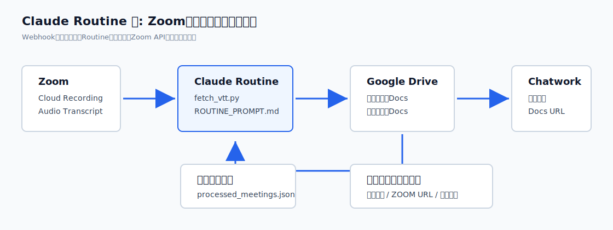
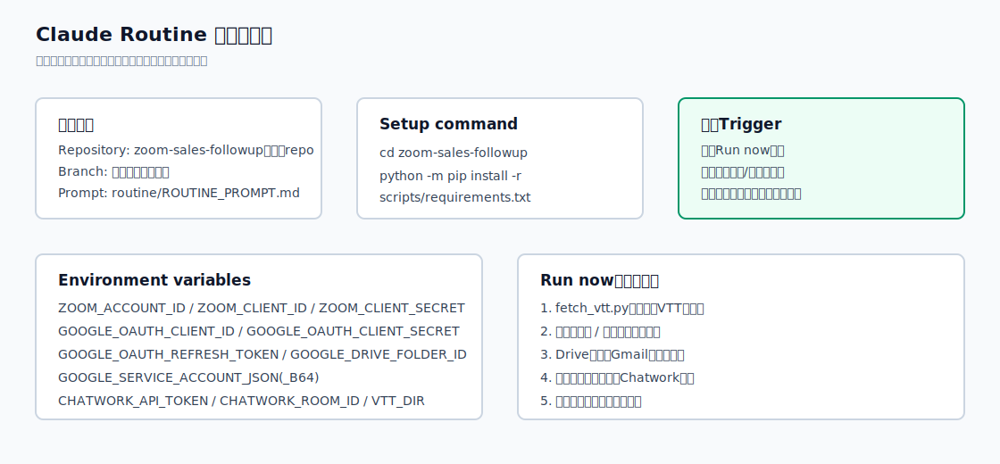

# Routine同行セットアップカンペ

作成日: 2026-05-24  
用途: 他の人のZoom/Google/Claudeアカウントで、横についてRoutine設定する時に見るカンペ。  
詳細な背景・権限説明は `OTHER_ACCOUNT_SETUP_FLOW.md` を参照。

## まず全体像



この運用はClaude Routine用。Zoom Webhookは使わない。  
Routineが定期的にZoom APIへ録画一覧を取りに行き、未処理分だけメール下書き化する。

## 当日持っておくもの

| 種類 | 必要なもの | 注意 |
|---|---|---|
| Zoom | 管理者権限、またはS2S Appと録画設定を触れるカスタムロール | 全営業担当分を取るなら管理者権限が必要 |
| Google | 保存先Driveフォルダ、OAuth refresh token取得用のGoogleログイン、Gmail下書き用サービスアカウント | Drive保存は保存先Googleの容量、Gmail下書きはWorkspaceドメインワイド委任 |
| Chatwork | API token、Room ID | API tokenの値は画面共有やスクショに出さない |
| Claude | Routineを作るClaudeアカウント、対象repoへのアクセス | 初回はRun nowだけで確認 |

## 通常ブラウザでスクショを取る

GoogleやClaudeは自動化ブラウザだとログインできないことがある。  
そのため、実画面のスクショは通常のChromeなどログイン済みブラウザで開き、macOSのウィンドウ選択スクショで保存する。

```bash
cd zoom-sales-followup
bash docs/setup/capture_setup_screenshots.sh
```

一部だけ撮る場合:

```bash
cd zoom-sales-followup
bash docs/setup/capture_setup_screenshots.sh 6 7 8 9 10
```

動き:

1. 通常のChromeなどで対象画面を開く
2. ターミナルでEnterを押す
3. 撮影したいブラウザウィンドウをクリックする
4. `docs/setup/assets/screenshots/` にPNGが保存される

重要:

- Client Secret、API token、refresh token、パスワードは絶対に画面に出した状態で撮らない
- Routine環境変数画面は、値がマスクされている状態で撮る
- Zoom App Credentialsは、Client Secretの値を表示しない状態で撮る

## まなさんアカウントで代替撮影できるもの

目的は「横について設定する時に、画面の場所で迷わないこと」。実アカウントの権限状態まで一致している必要はない。

| No | 画面 | まなさんアカウントで代替 | 方針 |
|---|---|---|---|
| 1 | Zoom 管理者権限 / ロール | △ | 管理者画面が見えなければ撮らない。喜納さん側で本番確認 |
| 2 | Zoom 録画・文字起こし設定 | △ | 見える範囲でOK。Account Settingsが見えなければPersonal Settingsで代替 |
| 3 | Zoom S2S OAuth App 基本情報 | △ | Marketplaceの場所だけならOK。Client Secretは撮らない |
| 4 | Zoom S2S OAuth App スコープ | △ | 画面に入れれば代替可。権限不足ならプレースホルダ |
| 5 | Zoom 録画一覧 / VTT確認 | △ | 自分の録画一覧で代替可。本番は喜納さん側の録画で確認 |
| 6 | Google Drive 保存先フォルダ | ○ | まなさんDriveで代替可 |
| 7 | Chatwork 通知先ルーム | ○ | 通知先ルームが同じならそのまま使える |
| 8 | Claude Routine 基本設定 | ○ | まなさんアカウントで撮影可 |
| 9 | Claude Routine 環境変数 | ○ | 値がマスクされた状態なら撮影可 |
| 10 | Claude Routine Run now / 実行ログ | ○ | テストRunのログで代替可 |

おすすめ撮影順:

```text
まず 6,7,8,9 を撮る。
Zoom側は、まなさんアカウントで見える範囲だけ 2,3,4,5 を撮る。
1 は権限画面なので、喜納さんアカウントでは撮らず、当日チェック項目として残す。
```

## 1. Zoom管理者権限

見る場所:

```text
Zoom Web Portal
> Admin
> User Management
> Roles または Users
```

確認すること:

- 設定する人がZoom管理者、または必要なカスタムロールを持っている
- Zoom App MarketplaceでServer-to-Server OAuth Appを作成・編集できる
- 録画設定、ユーザー一覧、録画一覧を確認できる

スクショ:


メモ:

```text
ここで詰まったら、以降のS2S OAuth Appや全ユーザー録画取得も詰まる。
先に権限付与を完了させる。
```

## 2. Zoom録画・文字起こし設定


見る場所:

```text
Zoom Web Portal
> Account Management
> Account Settings
> Recording & Transcript
```

確認すること:

- `Cloud Recording`: ON
- `Create audio transcript`: ON
- 対象ホストがLicensed user
- テスト録画がクラウド録画として保存される

スクショ:


言い方:

```text
ここは「録画ファイルがあるか」ではなく「VTT文字起こしが生成されるか」を見ます。
Cloud RecordingだけONでも、Create audio transcriptがOFFだとRoutine側で拾えません。
```

## 3. Zoom S2S OAuth App

見る場所:

```text
Zoom App Marketplace
> Develop
> Build App
> Server-to-Server OAuth
```

設定すること:

| 画面 | 見るもの |
|---|---|
| Basic Information | アプリ名、連絡先 |
| App Credentials | Account ID / Client ID / Client Secret |
| Scopes | user read系、recording read系 |
| Activation | AppがActivatedになっていること |

スクショ:


Routine環境変数に入れる値:

```text
ZOOM_ACCOUNT_ID
ZOOM_CLIENT_ID
ZOOM_CLIENT_SECRET
```

注意:

```text
Client Secretは「値を控える」必要はあるが、「スクショに写す」必要はない。
画面共有中もRevealしない。
```

## 4. Zoom録画一覧でVTT確認

見る場所:

```text
Zoom Web Portal
> Account Management
> Recording and Transcript Management
> Recordings
```

確認すること:

- 対象ホストのテスト録画が見える
- 処理済み状態になっている
- Audio transcript / VTT相当のファイルがある
- 会議トピックから顧客名が抜ける

推奨トピック:

```text
【物販システム アクセス】ウェビナー個別面談 山田太郎様
```

スクショ:


## 5. Google Drive保存先

見る場所:

```text
Google Drive
> Routine出力用フォルダ
```

確認すること:

- 保存先フォルダがある
- 確認担当者が閲覧できる
- 送信担当者が閲覧できる
- URL内のフォルダIDを `GOOGLE_DRIVE_FOLDER_ID` に使う

現行の保存先:

```text
営業フォローメール_自動生成_仮置き
https://drive.google.com/drive/folders/1KeBeszfV4g1ORx8nQdni0EEdh9mrSBzB
GOOGLE_DRIVE_FOLDER_ID=1KeBeszfV4g1ORx8nQdni0EEdh9mrSBzB
```

スクショ:


OAuth refresh token取得:

```bash
cd zoom-sales-followup/scripts
python get_refresh_token.py /path/to/oauth.keys.json
```

Routine環境変数に入れる値:

```text
GOOGLE_OAUTH_CLIENT_ID
GOOGLE_OAUTH_CLIENT_SECRET
GOOGLE_OAUTH_REFRESH_TOKEN
GOOGLE_DRIVE_FOLDER_ID
GOOGLE_SERVICE_ACCOUNT_JSON or GOOGLE_SERVICE_ACCOUNT_JSON_B64
```

## 6. Chatwork通知先

見る場所:

```text
Chatwork
> 通知先ルーム
```

確認すること:

- API tokenの発行者がルームに投稿できる
- Room IDが正しい
- Docs URLが貼られても見えるメンバーだけのルームになっている

スクショ:


Routine環境変数に入れる値:

```text
CHATWORK_API_TOKEN
CHATWORK_ROOM_ID
```

## 7. Claude Routine設定



見る場所:

```text
Claude Code on the web
> Routines
> New Routine
```

設定すること:

| 項目 | 入れるもの |
|---|---|
| Name | Sales followup mail generator |
| Repository | `zoom-sales-followup` を含むrepo |
| Branch | 本番運用ブランチ |
| Prompt | `routine/ROUTINE_PROMPT.md` の全文 |
| Trigger | 最初はRun nowのみ |

スクショ:


Setup command:

```bash
cd zoom-sales-followup
python -m pip install -r scripts/requirements.txt
```

Environment variables:

```text
ZOOM_ACCOUNT_ID
ZOOM_CLIENT_ID
ZOOM_CLIENT_SECRET
GOOGLE_OAUTH_CLIENT_ID
GOOGLE_OAUTH_CLIENT_SECRET
GOOGLE_OAUTH_REFRESH_TOKEN
GOOGLE_DRIVE_FOLDER_ID
GOOGLE_SERVICE_ACCOUNT_JSON or GOOGLE_SERVICE_ACCOUNT_JSON_B64
CHATWORK_API_TOKEN
CHATWORK_ROOM_ID
VTT_DIR=/tmp/vtt
```

スクショ:


## 8. Run now確認

見る場所:

```text
Claude Routine
> Run now
> 実行ログ
```

成功条件:

- Step1: `fetch_vtt.py` が未処理VTTを検出
- Step2: 顧客送付用 / 社内確認用が生成される
- Step3: Google Drive保存後に `processed_meetings.json` が更新される
- Step4: Chatwork通知が届く

スクショ:


確認の合言葉:

```text
緑ステータスだけでOKにしない。
DriveにDocsができたか、台帳が更新されたか、Chatwork通知が届いたかを見る。
```

## 9. 詰まった時の最短切り分け

| 止まる場所 | まず見るところ |
|---|---|
| Zoom認証 | S2S AppがActivatedか、Account ID / Client ID / SecretがRoutineに入っているか |
| ユーザー一覧取得 | user read系スコープ、管理者ロール |
| 録画取得 | recording read系スコープ、対象ホストがLicensedか |
| VTTなし | `Create audio transcript` がONか、録画処理が完了しているか |
| Google保存失敗 | refresh token、`GOOGLE_DRIVE_FOLDER_ID`、Drive共有 |
| Gmail下書き失敗 | Gmail API、Domain-wide delegation、`gmail.compose` scope、host_email |
| Chatwork通知失敗 | API token、Room ID、投稿権限 |
| Routineだけ失敗 | Environment variables、Setup command、Network access、Run log |

## 10. 最後に確認すること

- [ ] Webhook設定はしていない
- [ ] Event subscriptionsはOFF
- [ ] RoutineはRun nowでテスト済み
- [ ] Driveに顧客送付用と社内確認用が保存された
- [ ] 営業担当Gmailに下書きが作成された
- [ ] `processed_meetings.json` が更新された
- [ ] Chatwork通知が届いた
- [ ] 送信は人間確認後の手動運用になっている
